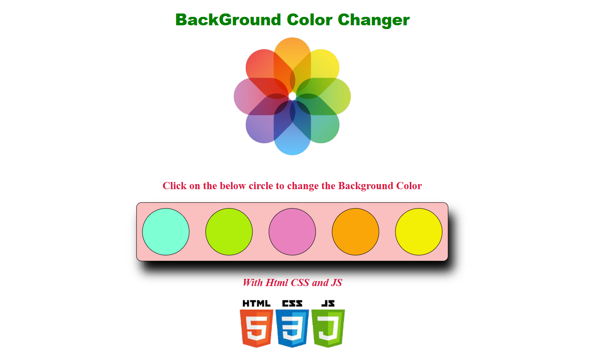
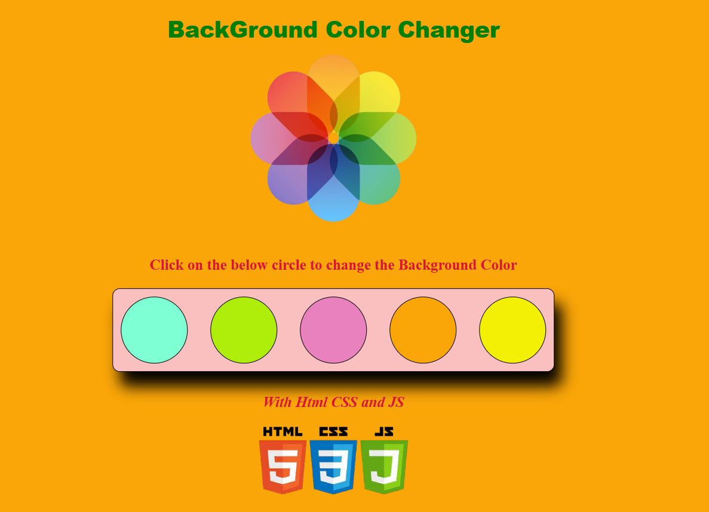
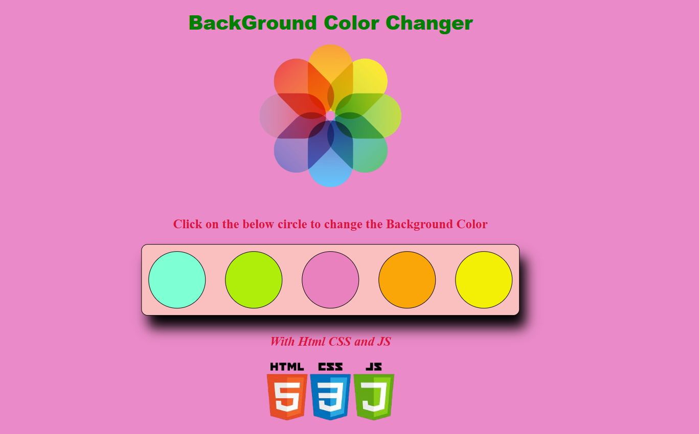

# 🎨 Background Colour Change

[](https://RajalaxmiSarangi.github.io/Background-Colour-Change/)

A fun and interactive web project that lets you **instantly change the background color** of the page using JavaScript.  
Perfect for learning **DOM manipulation** and **event handling** in a playful way! ✨

---

## ✨ Features

- 🎯 **Color Selector** – Choose from predefined colors or use a custom input.
- 🖱 **Interactive Controls** – Works via buttons, dropdowns, or color picker.
- 🎨 **Customizable** – Easily add more colors or UI elements.
- ⚡ **Lightweight** – Runs directly in your browser without installations.

---

## 🚀 How to Run Locally

### 1️⃣ Clone the Repository
```bash
git clone https://github.com/RajalaxmiSarangi/Background-Colour-Change.git
cd Background-Colour-Change
```
### 2️⃣ Open in Browser

Simply double-click index.html
or run:

open index.html

(You can also right-click → Open with → select your browser)

### 3️⃣ Change the Background

Click buttons, choose from dropdowns, or pick a custom color to change the page background in real time.

---

### 📷 Screenshots
<p align="center">    </p>

---

### 💡 Suggested Enhancements

**🎨 Color Picker Input** – Let users choose any color via an <input type="color">.

**🎲 Random Color Button*** – Change to a random color with one click.

**🌈 Animated Transitions** – Smooth fade between colors.

**🌙 Dark/Light Mode Toggle** – Quick theme switching.

---

